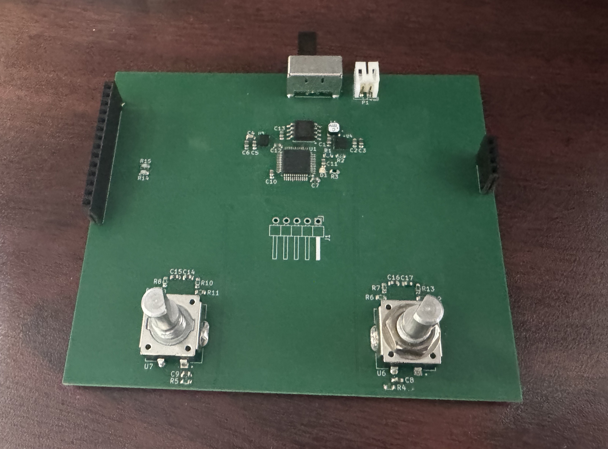

# Digital Etch-A-Sketch

The **Digital Etch-A-Sketch** is a portable recreation of the classic Etch-A-Sketch drawing toy, built around an STM32 microcontroller, a 3.5" TFT display, and  rotary encoders for drawing cursor control. This project's main features are a motion-based erase and flip-book style animation playback.

> **Status:** Proof of concept completed on STM32 Nucleo board  
> **Hardware Version:** Rev0

---

## Features

- **Freehand Drawing**
  - Pixel-accurate cursor control
  - Encoder movement acceleration based control (Not Yet Implemented)
  - Pick-up / put-down cursor mode (Not Yet Implemented)
  - Multiple drawing thicknesses (Not Yet Implemented)

- **Physical Controls**
  - Two rotary encoders for X/Y movement
  - Push buttons for erase, menu, and selection (Menu Not Yet Implemented)

- **Shake to Erase**
  - Gyroscope + accelerometer detect motion (Not Yet Implemented)
  - Realistic screen erase gesture (Not Yet Implemented)

- **Flip-Book Animation Mode**
  - Store up to ~80 frames in external flash (Not Yet Implemented)
  - Automatic playback (Not Yet Implemented) 
  - Previous frame shown in light gray while drawing next (Not Yet Implemented)

- **Portable & Low Power**
  - Powered by 2× AA batteries
  - Boost converter to regulated 3.3 V
  - Low-power MCU modes with motion-based wakeup

---

## Bill of Materials (Summary)

| Item            | Part Number        | Qty | Notes |
|-----------------|--------------------|-----|-------|
| MCU             | STM32L433CCT6      | 1   | Main controller |
| Display         | 3.5" ILI9488 SPI   | 1   | 3.5" display |
| QSPI Flash      | W25Q64JV           | 1   | 8 MB frame storage |
| 6-axis IMU      | ICM-42688-P        | 1   | 6-axis motion sensor |
| Boost Converter | TPS61201DRC        | 1   | Boost to 3.3 V |
| Rotary Encoder  | PEC11R-4215F-S0024 | 2   | User input |
| Battery Holder  | Adafruit 4194      | 1   | 2× AA |

---

## Hardware Subsystems

### Power Supply

- **Part:** TI TPS61201
- **Input:** 2 × AA batteries (2.2–3.2 V)
- **Output:** 3.3 V regulated
- **Max Load:** ~400 mA
- **Purpose:** Powers the entire system from AA cells

---

### Microcontroller

- **Part:** STM32L433CCT3 / STM32L433CCT6  
- **Clock:** 80 MHz (internal)
- **Memory:**  
  - 256 KB Flash  
  - 64 KB RAM  

**Key Peripherals**

| Function         | Peripheral | Notes |
|------------------|------------|-------|
| Display          | SPI3       | Half-duplex, optimized for fast updates |
| IMU              | SPI2, EXTI | Full-duplex |
| Flash memory     | Quad-SPI   | Memory-mapped reads |
| Rotary Encoders  | TIM1&2, EXTI | QEI mode with interrupts |
| Debug            | SWD        | DIO, CLK, NRST |

---

### Display

- **Type:** 3.5" TFT Display
- **Controller:** ILI9488
- **Interface:** Dedicated 4-wire SPI
- **Power:** 3.3 V
- **Frame Buffer:** Embedded GRAM
- **Update Modes:** Full and partial refresh
The screen is mounted to the board using the female pin headers on either side. The touchscreen functionality of the screen is not used, so the touchscreen pins are not conected.

---

### Storage

- **Part:** Winbond W25Q64JV
- **Capacity:** 8 MB (64 Mbit)
- **Interface:** Quad SPI
- **Purpose:**
  - Store animation frames
  - Potential configuration data

---

### Motion Sensor

- **Part:** TDK ICM-42688-P
- **Interface:** SPI
- **Capabilities:** 6-axis IMU (accelerometer + gyroscope)
- **Usage:**
  - Detect shake gesture for screen erase
  - Motion-based wakeup from low power
  - Data-ready interrupts for efficient sampling

---

### Rotary Encoders

- **Quantity:** 2
- **Part:** PEC11R-4215F-S0024
- **Purpose:**
  - X-axis and Y-axis cursor movement
  - UI interaction via push buttons

**Connections**
- A/B channels → Timer QEI inputs
- Buttons → EXTI interrupts
- Hardware Pull-ups (open-drain behavior)

---

## Firmware Architecture

### Overview

The firmware runs mainly inside of a state machine, easily allowing for the same user inputs to be used for different purposes. Standard drawing is state 0, with other states added as needed.

---

## Debug & Firmware Update

- **Interface:** SWD
- **Pins Required:**  
  - DIO  
  - CLK  
  - NRST  
  - VCC  
  - GND  